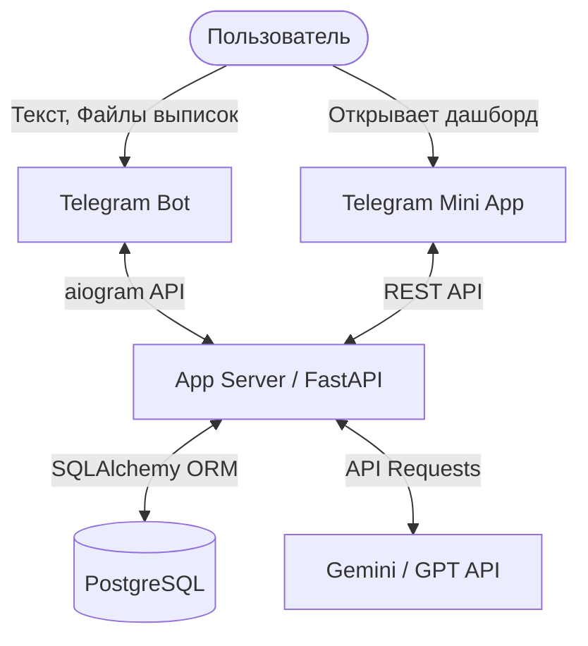
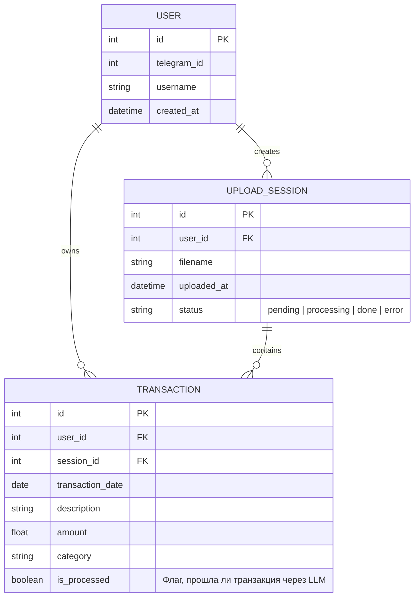

# Архитектура проекта

## 1. Компоненты системы
- **Telegram-клиент**: Интерфейс взаимодействия с пользователем (чат и кнопка Mini App).
- **Бот-сервис (aiogram 3)**: Отвечает за прием сообщений, файлов выписок и маршрутизацию команд.
- **Web API (FastAPI)**: Служит бэкендом для Mini App (отдает данные для графиков) и объединяет логику.
- **LLM API (Gemini/GPT)**: Внешний сервис для автоматической категоризации транзакций и генерации ответов.
- **База данных (PostgreSQL)**: Хранит пользователей, историю загрузок и сами транзакции.

## 2. Диаграмма архитектуры (High-level)

## 3. Модель данных (ER-диаграмма)

## 4. Общий алгоритм обработки файла (Data Flow)
1. Пользователь скидывает `.csv` файл в бота.
2. Бот скачивает файл, создает запись `UPLOAD_SESSION` со статусом `pending`.
3. Парсер читает CSV и сохраняет сырые `TRANSACTION` (категория пустая, `is_processed=False`).
4. Сервис берет пачку неразмеченных транзакций и отправляет единым JSON-запросом в LLM API с промптом категорий.
5. LLM возвращает размеченный JSON (каждой транзакции присвоена категория).
6. База данных обновляется, `is_processed=True`, статус сессии `done`.
7. Пользователь получает уведомление в Telegram: "Файл успешно обработан".
