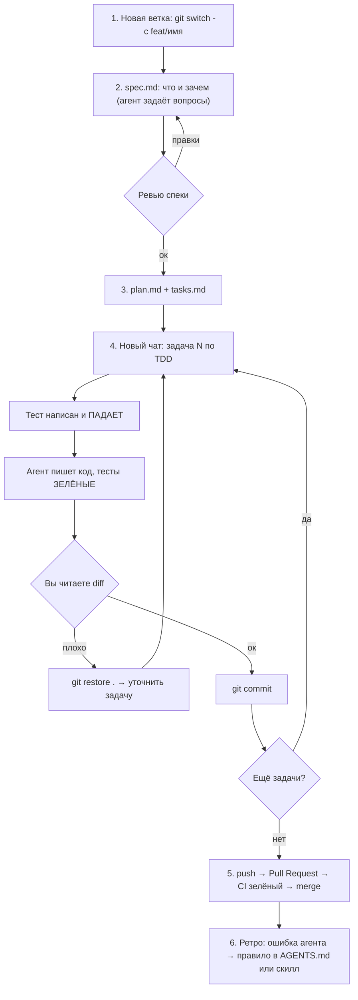

# Путь: первый большой проект с AI-агентом, без вайбкодинга

> [!IMPORTANT]
> **Главная идея.** Вайбкодинг — это «промпт → код → надежда». Качественная разработка с агентом выглядит так: **ТЗ → архитектура → спецификация → тест → код → проверка → коммит**. Агент пишет код, **а вы управляете процессом**. Все темы из гайда — это инструменты управления.
>
> Мы не изучаем темы по отдельности. **Каждую тему вы освоите в тот момент, когда она понадобится проекту.**

---

## Ваше окружение (я проверил)

| Инструмент | Статус |
|---|---|
| Git 2.55 | ✅ установлен, имя и email настроены |
| GitHub CLI (`gh`) | ✅ вы залогинены как `Matakkk666` |
| Python 3.14 | ✅ |
| Node.js 24 | ✅ |
| Docker | ❌ не нужен до шага 9, тогда и установим |

Можно начинать прямо сейчас.

---

## 7 золотых правил (повесьте перед глазами)

1. **Один чат = одна задача.** На каждую новую задачу открывайте новый чат. В длинном чате агент «тупеет», потому что контекст переполняется.
2. **Сначала план, потом код.** В любой задаче крупнее пары строк сначала просите план (Planning Mode), читаете его и только потом даёте «ок».
3. **Маленькие шаги.** Одна задача — это примерно ≤ 1 час работы и ≤ 200–300 строк изменений. Большие задачи дробите.
4. **Готово = тесты зелёные.** Агент должен сам запустить тесты, прежде чем говорить «готово».
5. **Коммит после каждого зелёного шага.** Коммит — точка сохранения, как в игре.
6. **Читайте diff.** Не принимайте код, который не просмотрели. Если непонятно, спросите агента: «объясни, что ты изменил и почему».
7. **Агент ходит по кругу 2–3 раза → стоп.** Откатитесь (`git restore .`), уточните задачу и начните в новом чате. Не уговаривайте его в том же чате.

---

## Структура вашего будущего проекта

```
my-project/
├── AGENTS.md                ← правила для агента (читает автоматически)
├── README.md                ← описание для людей
├── .agents/
│   └── skills/              ← ваши скиллы (шаг 7)
├── docs/
│   ├── tz.md                ← ТЗ (шаг 2)
│   ├── architecture.md      ← system design (шаг 3)
│   ├── decisions/           ← почему выбрали X, а не Y (ADR)
│   ├── roadmap.md           ← список фич по порядку
│   └── journey.md           ← ваш прогресс по этому пути
├── specs/
│   └── 001-<фича>/
│       ├── spec.md          ← что делаем
│       ├── plan.md          ← как делаем
│       └── tasks.md         ← маленькие задачи
├── src/                     ← код
├── tests/                   ← тесты
└── .github/workflows/ci.yml ← автопроверки (шаг 4)
```

> [!NOTE]
> `docs/` и `specs/` — это **долговременная память проекта**. Агент не помнит прошлые чаты, но всегда может прочитать эти файлы. Поэтому в новом чате достаточно сказать «прочитай specs/003 и сделай задачу 4».

---

## Главный цикл (его вы будете повторять для каждой фичи)

Это ядро всего пути. Шаги 0–4 готовят проект к этому циклу, шаги 5–10 его повторяют и усложняют.



---

## Шаги пути

### Шаг 0. Подготовка (≈30 минут)
**Осваиваем:** workspace в IDE.
- [ ] Создать папку проекта, например `C:\Users\matthew\projects\<имя>`.
- [ ] Открыть её в IDE как **workspace** (File → Open Folder). Агент видит только файлы workspace.
- [ ] Найти в IDE: чат агента, режим планирования, панель **Source Control** (Git), терминал.

**Готово, когда:** папка открыта, агент в чате отвечает на «что лежит в этом проекте?».

---

### Шаг 1. Git: необходимый минимум (≈1–2 часа)
**Осваиваем:** Git.
- [ ] Пройти первые 2 раздела тренажёра [Learn Git Branching](https://learngitbranching.js.org/?locale=ru_RU) (Main: «Введение» и «Едем дальше»).
- [ ] Выучить 10 команд из шпаргалки ниже. Больше на старте не нужно.
- [ ] `git init`, первый коммит, `gh repo create` → проект на GitHub.

**Готово, когда:** на GitHub лежит ваш репозиторий с первым коммитом, и вы можете объяснить, что такое коммит, ветка и push.

---

### Шаг 2. Идея → ТЗ (≈1 вечер)
**Осваиваем:** ТЗ.
- [ ] Рассказать агенту идею своими словами и запустить интервью (`/grill-me` или промпт ниже).
- [ ] Получить `docs/tz.md`: цель, пользователи, **MVP-скоуп**, **что НЕ делаем**, user stories, критерии приёмки.
- [ ] Получить `docs/roadmap.md`: фичи по порядку, от MVP к расширениям.

**Промпт:**
```
Я хочу сделать <идея>. Проведи со мной интервью, чтобы составить ТЗ.
Задавай вопросы по 3–5 за раз: о пользователях, сценариях, ограничениях, MVP.
Не пиши код. Когда вопросов не останется, создай docs/tz.md и docs/roadmap.md.
В ТЗ обязательно раздел «Что НЕ входит в MVP».
```

**Готово, когда:** вы прочитали ТЗ целиком и согласны с каждой строкой. Коммит `docs: add tz and roadmap`.

> [!WARNING]
> Самая частая ошибка — слишком большой MVP. Если в первой версии больше 5–7 фич, режьте.

---

### Шаг 3. System design (≈1 вечер)
**Осваиваем:** System design, решения с обоснованием.
- [ ] Попросить агента предложить **2–3 варианта** архитектуры и стека с плюсами и минусами.
- [ ] **Выбрать самому** и понять почему.
- [ ] Получить `docs/architecture.md`: компоненты, mermaid-схема, модель данных, API, где что хранится.
- [ ] Записать ключевые решения в `docs/decisions/0001-<решение>.md`.

**Промпт:**
```
Прочитай docs/tz.md. Предложи 2–3 варианта архитектуры и стека для MVP.
Для каждого: схема компонентов, плюсы, минусы, сложность для новичка.
Учитывай, что я только учусь — простота важнее модности. Код не пиши.
```
Затем:
```
Выбираю вариант N. Создай docs/architecture.md (с mermaid-схемой, моделью данных
и списком API) и docs/decisions/0001-stack.md с обоснованием выбора.
```

**Готово, когда:** вы можете нарисовать схему системы на бумаге и объяснить, зачем нужен каждый блок.

---

### Шаг 4. Скелет проекта + AGENTS.md + CI (≈1–2 вечера)
**Осваиваем:** правила агента, тестовый фреймворк, CI, ветки и PR.
- [ ] Ветка `chore/skeleton`.
- [ ] Агент создаёт скелет: структуру папок, зависимости, **один тривиальный тест**, который проходит.
- [ ] Создать `AGENTS.md` (шаблон ниже).
- [ ] Настроить GitHub Actions: на каждый push запускаются линтер и тесты.
- [ ] Первый **Pull Request** → CI зелёный → merge в `main`.

**Готово, когда:** на GitHub у PR стоит зелёная галочка CI, а `main` содержит рабочий скелет.

> [!TIP]
> С этого момента у вас есть **страховочная сетка**: тесты и CI автоматически ловят, если агент что-то сломал. Это главное отличие от вайбкодинга.

---

### Шаг 5. Первая фича полным циклом (≈2–4 вечера) ⭐ самый важный шаг
**Осваиваем:** Spec driven dev, TDD, Agent loop, весь главный цикл.

Берём **самую простую** фичу из roadmap и проходим главный цикл медленно, осознавая каждый шаг. Этот шаг лучше пройти вместе со мной.

**Промпты по этапам цикла:**

**Спека:**
```
Фича: <название из roadmap>. Прочитай docs/tz.md и docs/architecture.md.
Задай мне уточняющие вопросы, затем создай specs/001-<имя>/spec.md:
цель, user stories, критерии приёмки в формате Given/When/Then, edge cases,
что НЕ входит. Код не пиши.
```
**План и задачи:**
```
Прочитай specs/001-<имя>/spec.md. Создай plan.md (какие файлы/модули/модели
затронем, как) и tasks.md — список задач, каждая ≤ 1 часа, с критерием готовности.
Порядок: от фундамента к UI. Код не пиши.
```
**Реализация задачи (каждая в НОВОМ чате):**
```
Прочитай AGENTS.md и specs/001-<имя>/ (spec, plan, tasks).
Выполни задачу N по TDD:
1) напиши тест(ы) по критериям задачи, запусти и покажи, что они ПАДАЮТ;
2) напиши минимальную реализацию, чтобы тесты прошли;
3) запусти ВСЕ тесты и линтер;
4) отметь задачу в tasks.md и кратко объясни, что изменил.
Не меняй существующие тесты.
```
**Ревью перед коммитом:**
```
Сделай ревью своих изменений (git diff) как строгий senior-разработчик:
баги, edge cases, нарушения AGENTS.md и architecture.md, лишний код.
```

**Готово, когда:** фича в `main` через PR, CI зелёный, все задачи в `tasks.md` отмечены, и вы можете объяснить каждый файл, который изменился.

---

### Шаг 6. Фичи 2…N (основная часть проекта)
**Осваиваем:** превращение цикла в привычку.
- [ ] Повторяйте главный цикл для каждой фичи из roadmap.
- [ ] **После каждой фичи 5-минутное ретро:** где агент ошибся? → добавить правило в `AGENTS.md`.
- [ ] Иногда просите агента: «Объясни, как работает <модуль>, как будто я джун». Так вы понимаете собственный проект.

---

### Шаг 7. Скиллы (после 2–3 фич)
**Осваиваем:** скиллы.
- [ ] Посмотреть, какие действия повторяются: добавить эндпоинт, создать миграцию, новый экран, релиз.
- [ ] Для каждого повторяющегося действия создать `.agents/skills/<имя>/SKILL.md`.
- [ ] Проверить, что агент сам подхватывает скилл, когда вы просите выполнить такую задачу.

**Промпт:**
```
Посмотри на git log и specs/. Какие процедуры я повторял 2+ раз?
Предложи 2–3 скилла и создай их в .agents/skills/ по формату SKILL.md
(YAML-заголовок name + description, затем пошаговая инструкция).
```

---

### Шаг 8. Оркестрация (когда проект вырос)
**Осваиваем:** субагенты, параллельная работа, git worktree.
- [ ] **Субагент-исследователь:** «Используй субагента, чтобы изучить, как устроен модуль X, и верни краткое резюме». Так основной чат не засоряется.
- [ ] **Агент-ревьюер:** отдельный чат, который только ревьюит PR по `spec.md`.
- [ ] **Параллельные фичи:** две независимые задачи в двух `git worktree` двумя агентами одновременно.
- [ ] Попробовать `/teamwork-preview` для крупной задачи.

> [!CAUTION]
> Не начинайте с параллельных агентов. Сначала главный цикл должен стать привычным. Иначе вы получите вдвое больше хаоса, а не вдвое больше скорости.

---

### Шаг 9. DevOps: проект в интернет
**Осваиваем:** Docker, CD, мониторинг.
- [ ] Установить Docker Desktop.
- [ ] `Dockerfile` + `docker-compose.yml`, чтобы проект запускался одной командой.
- [ ] Деплой (Render / Fly.io / Railway / VPS) и автодеплой из `main` через GitHub Actions.
- [ ] Секреты только в переменных окружения и GitHub Secrets, **никогда не в коде**.
- [ ] Healthcheck, логи, уведомление о падении.

**Готово, когда:** у проекта есть публичный URL, а merge в `main` автоматически обновляет прод.

---

### Шаг 10. Жизнь после релиза
**Осваиваем:** изменение требований через спеку, баги через TDD.
- [ ] Новое требование → **сначала правка `spec.md`**, потом код.
- [ ] Баг → **сначала тест, воспроизводящий баг** (он падает), потом фикс.
- [ ] Повторная оценка `AGENTS.md` и скиллов: что устарело?

---

## Шаблон AGENTS.md (стартовый)

```markdown
# <Название проекта>

## О проекте
<1–2 предложения>. Подробно: docs/tz.md, архитектура: docs/architecture.md.

## Стек
<язык, фреймворк, БД, тесты>

## Команды
- Установка: `<cmd>`
- Запуск: `<cmd>`
- Тесты: `<cmd>`
- Линтер: `<cmd>`

## Процесс работы
- Работаем по спецификациям в specs/. Перед задачей читай spec.md, plan.md, tasks.md.
- TDD: сначала тест, убедись что падает, затем реализация.
- Перед завершением ВСЕГДА запускай тесты и линтер. Задача не готова, пока они не зелёные.
- После выполнения отмечай задачу в tasks.md.

## Запреты
- НЕ изменяй существующие тесты без явного разрешения.
- НЕ добавляй новые зависимости без согласования.
- НЕ выходи за рамки текущей задачи (никаких «заодно отрефакторил»).
- НЕ храни секреты в коде.

## Конвенции
- Коммиты: Conventional Commits (feat:, fix:, docs:, test:, refactor:, chore:).
- <стиль кода, именование, структура папок>

## Уроки (пополняется после ретро)
- <сюда добавляем правила после ошибок агента>
```

> [!NOTE]
> `AGENTS.md` понимают Antigravity, Cursor, Codex и другие. Claude Code читает `CLAUDE.md`: если пользуетесь им, сделайте `CLAUDE.md` со строкой «См. AGENTS.md».

---

## Шпаргалка Git: 10 команд на старт

| Команда | Что делает | Когда |
|---|---|---|
| `git status` | что изменилось | **постоянно**, перед любым действием |
| `git diff` | построчные изменения | перед коммитом, ревью работы агента |
| `git add .` | подготовить все изменения к коммиту | перед коммитом |
| `git commit -m "feat: ..."` | сохранить точку | после каждого зелёного шага |
| `git log --oneline -10` | история | посмотреть, что было |
| `git switch -c feat/имя` | создать ветку и перейти в неё | начало фичи |
| `git switch main` | вернуться в main | после merge |
| `git push -u origin feat/имя` | отправить ветку на GitHub | перед PR |
| `git pull` | забрать изменения с GitHub | после merge PR |
| `git restore .` | **откатить все незакоммиченные изменения** | агент всё испортил |

**PR через терминал:** `gh pr create --fill` → `gh pr checks` → `gh pr merge --squash --delete-branch`

> [!TIP]
> Всё это доступно и кнопками в панели **Source Control** IDE. Но первые две недели набирайте команды руками, так быстрее приходит понимание.

---

## Что делать, если…

| Ситуация | Действие |
|---|---|
| Агент сделал не то | `git restore .` → уточнить задачу → новый чат |
| Агент сломал то, что уже было закоммичено | `git log --oneline` → `git reset --hard <хеш>` (только если ещё не пушили!) |
| Агент ходит по кругу и не может починить | стоп; попросить: «Опиши проблему и 3 гипотезы причины, код не трогай» |
| Агент «починил», изменив тест | откат; добавить в AGENTS.md запрет; повторить |
| Не понимаю код, который он написал | «Объясни этот файл построчно для новичка» — это нормально и полезно |
| Чат стал длинным, ответы хуже | новый чат: «Прочитай AGENTS.md и specs/00X, продолжаем с задачи N» |
| Задача оказалась большой | остановиться, попросить разбить её на подзадачи в tasks.md |
| CI красный | «Посмотри на ошибку CI: `gh run view --log-failed` и исправь» |

---

## Как мы пройдём этот путь вместе

1. **Вы выбираете идею и стек** (см. вопросы в чате).
2. Я создаю папку проекта и `docs/journey.md`, чеклист этого пути, где отмечаем прогресс.
3. Вы открываете папку проекта как workspace в IDE.
4. В каждой сессии пишете: **«Продолжаем путь, прочитай docs/journey.md»**. Я вижу, где мы остановились, и веду дальше.
5. На каждом шаге я объясняю, **что** мы делаем и **зачем**, а ключевые действия (команды Git, ревью, решения) **делаете вы**. Я подсказываю и проверяю.

> [!IMPORTANT]
> Первые шаги идут медленно, и это нормально. Шаг 5 может занять неделю. Зато после него вы будете уметь то, что 90% вайбкодеров не умеют: строить проект, который не разваливается при росте.
