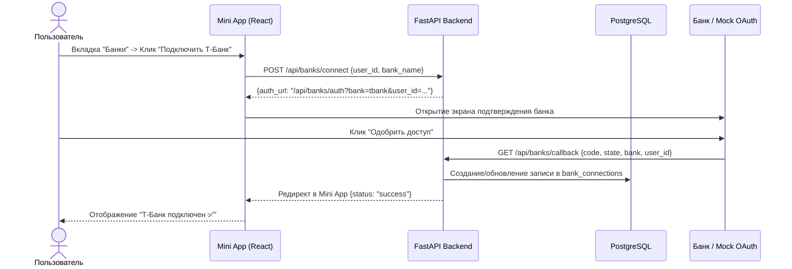

# Спецификация: 008-bank-oauth-connect (Бесшовное подключение банков в Mini App)

## 1. Контекст и проблема
Сейчас для подключения банка пользователю требуется вручную находить API-токены и настраивать переменные окружения. Для обычного человека это сложно и неудобно.

**Цель фичи:** Дать пользователю возможность в один клик подключать свои банковские счета прямо в Telegram Mini App без ручного ввода реквизитов и токенов — через переход в приложение банка (OAuth / Deeplink flow) и подтверждение доступа по кнопке «Одобрить».

---

## 2. Архитектура и сценарий (OAuth Consent Flow)

### Пользовательский путь (User Journey):
1. Пользователь открывает вкладку **«Банки»** в Telegram Mini App.
2. Видит список банков с логотипами и статусами:
   - 🟡 **Т-Банк** — *Не подключен* ➡️ Кнопка `[Подключить]`
   - 🟢 **Сбербанк** — *Не подключен* ➡️ Кнопка `[Подключить]`
   - 🔴 **МКБ** — *Не подключен* ➡️ Кнопка `[Подключить]`
3. Пользователь нажимает `[Подключить]` у Т-Банка.
4. Открывается защищенный экран подтверждения банка (OAuth / Mock Bank Consent Screen):
   - *"Вход через Т-Банк ID"*
   - *"Приложение «Финансовый Ассистент» запрашивает доступ к истории операций"*
   - Кнопки: `[Одобрить доступ]` / `[Отмена]`
5. Пользователь нажимает `[Одобрить доступ]`.
6. Банк подтверждает авторизацию, возвращает пользователя в Mini App:
   - Статус меняется на `Активен ✅`.
   - Появляется кнопка `[Синхронизировать]` и дата последней синхронизации.
7. При клике `[Синхронизировать]` новые транзакции моментально подтягиваются в базу данных и отображаются в дашборде.

### Схема взаимодействия (Sequence Diagram):

---

## 3. Модель данных (БД)

Таблица `bank_connections` в PostgreSQL:
- `id`: UUID (Primary Key)
- `user_id`: BigInteger (Telegram User ID)
- `bank_name`: String (`tbank`, `sber`, `mkb`, `mock`)
- `status`: String (`connected`, `disconnected`)
- `connected_at`: DateTime (время создания связи)
- `last_synced_at`: DateTime (время последней успешной синхронизации, опционально)

---

## 4. REST API Эндпоинты

1. `GET /api/banks?user_id=...`
   - Возвращает список всех поддерживаемых банков и их статус для пользователя (`connected` / `disconnected`).
2. `POST /api/banks/connect`
   - Тело: `{"user_id": int, "bank_name": str}`
   - Возвращает: `{"auth_url": str}`
3. `GET /api/banks/auth-screen?bank=...&user_id=...`
   - Возвращает интерактивную HTML-страницу подтверждения банка (для симулятора и веб-авторизации).
4. `GET /api/banks/callback?bank=...&user_id=...&code=...`
   - Обрабатывает подтверждение, активирует статус в `bank_connections` и возвращает пользователя в Mini App.
5. `POST /api/banks/sync`
   - Тело: `{"user_id": int, "bank_name": str}`
   - Вызывает `sync_user_bank` для подключенного банка и возвращает количество новых транзакций.
6. `POST /api/banks/disconnect`
   - Тело: `{"user_id": int, "bank_name": str}`
   - Отключает банк.

---

## 5. Требования к UI (Telegram Mini App)
- Новая вкладка **«Банки»** в нижней панели навигации (иконка `Landmark` / `CreditCard`).
- Карточки банков с фирменными цветами:
  - Т-Банк: желто-черный акцент.
  - Сбер: зеленый акцент.
  - МКБ: бордово-красный акцент.
- Индикаторы состояния (`Не подключен` ➡️ `Подключен`).
- Кнопка быстрой синхронизации с анимацией загрузки (спиннер).
